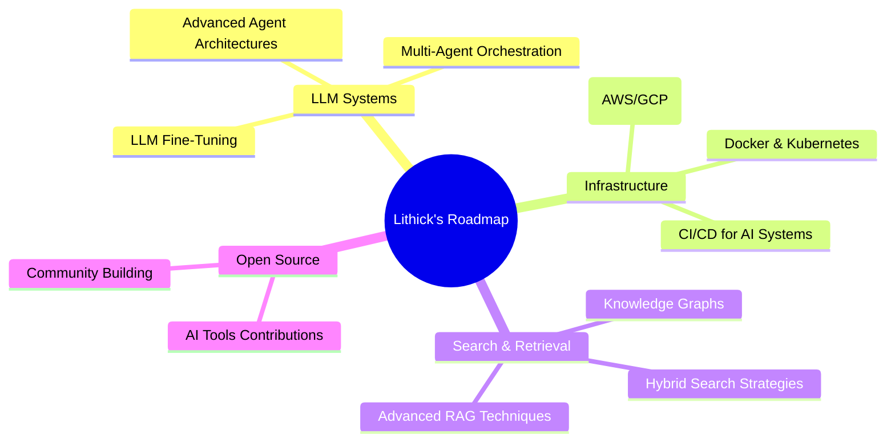

<div align="center">


<br/>

[](https://git.io/typing-svg)

<br/>

<p align="center">
  <a href="https://www.linkedin.com/in/lithicksanjaiyan">
    
  </a>&nbsp;
  <a href="mailto:lithicksanjaiyan@gmail.com">
    
  </a>&nbsp;
  <a href="https://github.com/Lithick-Sanjaiyan-S">
    
  </a>&nbsp;
  <a href="https://leetcode.com/">
    
  </a>
</p>

<br/>


&nbsp;


</div>

<br/>


<br/>

##  &nbsp; About Me

```python
class AIEngineer:
    def __init__(self):
        self.name         = "Lithick Sanjaiyan S"
        self.location     = "Chennai, Tamil Nadu, India 🇮🇳"
        self.education    = "B.Tech — Artificial Intelligence & Data Science (2022–2026)"
        self.college      = "Karpagam College of Engineering  |  CGPA: 8.1/10"
        self.role         = "AI Engineer Intern @ Prayag.ai"
        self.focus        = ["LLM Applications", "Agentic Workflows", "RAG Pipelines"]
        self.languages    = ["Python", "Java"]
        self.seeking      = "Junior AI Engineer @ AI-First Startups"
    
    def current_focus(self):
        return [
            "🤖  Shipping production-grade LLM applications",
            "🧠  Engineering multi-agent agentic systems",
            "⚡  Optimizing LLM latency & hallucination reduction",
            "🔍  Graph-based semantic search with Neo4j",
            "🎯  Mastering advanced prompt engineering patterns",
        ]

    def philosophy(self):
        return "Build AI that actually ships — fast, reliable, and hallucination-free."

me = AIEngineer()
print(me.philosophy())
# Output: "Build AI that actually ships — fast, reliable, and hallucination-free."
```

<br/>

> 🎯 **B.Tech AI & Data Science graduate** with hands-on production experience building **LLM applications, agentic systems, and RAG pipelines**. Proficient in OpenAI API, Gemini API, FastAPI, Neo4j, and vector search. Passionate about closing the gap between AI research and real-world impact. Currently seeking a **Junior AI Engineer** role at an AI-first startup.

<br/>


<br/>

## 🛠️ &nbsp; Tech Stack & Tools

<br/>

### 🧠 &nbsp; AI / LLM & Prompt Engineering

<p align="left">
  
  
  
  
  
  
  
  
</p>

### 🔍 &nbsp; Vector Search & Embeddings

<p align="left">
  
  
  
  
</p>

### 💻 &nbsp; Languages

<p align="left">
  
  
  
</p>

### ⚙️ &nbsp; Frameworks & APIs

<p align="left">
  
  
  
</p>

### 🗄️ &nbsp; Databases

<p align="left">
  
  
  
</p>

### 🔌 &nbsp; Integrations & SDKs

<p align="left">
  
  
  
  
  
</p>

### 📊 &nbsp; ML / Data Science

<p align="left">
  
  
  
</p>

### 🧰 &nbsp; Tools & Platforms

<p align="left">
  
  
  
  
  
</p>

<br/>


<br/>

## 📊 &nbsp; GitHub Analytics

<br/>

<div align="center">

<a href="https://github.com/Lithick-Sanjaiyan-S">
  
  &nbsp;&nbsp;
  
</a>

<br/><br/>


<br/><br/>


</div>

<br/>

<div align="center">
  <picture>
    <source media="(prefers-color-scheme: dark)" srcset="https://raw.githubusercontent.com/Lithick-Sanjaiyan-S/Lithick-Sanjaiyan-S/output/github-contribution-grid-snake-dark.svg" />
    <source media="(prefers-color-scheme: light)" srcset="https://raw.githubusercontent.com/Lithick-Sanjaiyan-S/Lithick-Sanjaiyan-S/output/github-contribution-grid-snake.svg" />
    
  </picture>
</div>

<br/>


<br/>

## 🏆 &nbsp; GitHub Trophies

<br/>

<div align="center">
  
</div>

<br/>


<br/>

## 💼 &nbsp; Experience

<br/>

<table>
<tr>
<td width="50px" align="center">

</td>
<td>

### 🤖 AI Engineer Intern — [Prayag.ai](https://prayag.ai) &nbsp; `Remote`

> **Jun 2025 – Jun 2026**

- 🚀 **Shipped 3 production-ready LLM applications** covering interview automation, voice-based appointment booking, and enterprise knowledge retrieval using agentic workflows and RAG pipelines.
- 🧠 **Engineered advanced prompt pipelines** using Chain-of-Thought and Few-Shot Prompting, improving LLM response consistency and reducing hallucinations via Pydantic-enforced structured output parsing.
- ⚡ **Optimized API latency** through caching, token tuning, and de-duplication strategies — achieving near real-time performance for all AI applications in production.
- 🔌 **Integrated multi-tool orchestration** across Twilio, LiveKit, Google Calendar API, MS Graph API, and Slack SDK to power end-to-end agentic workflows at scale.

**Key Technologies:** `Python` `FastAPI` `OpenAI API` `Gemini API` `Neo4j` `MongoDB` `PostgreSQL` `Pydantic` `Twilio` `LiveKit`

</td>
</tr>
</table>

<br/>


<br/>

## 🚀 &nbsp; Featured Projects

<br/>

<table>

<tr>
<td width="50%" valign="top">

### 🔎 Unified Knowledge Base Chatbot
**RAG Platform for Investors**

> A production-grade intelligent knowledge retrieval system powering investment research workflows.

**Highlights:**
- 📥 Ingests data from **Outlook, OneDrive, Slack, Fireflies, and Taghash**
- 🕸️ Structures entities in **Neo4j graph database** with semantic relationships
- 🔍 OpenAI text embeddings with **Top-K semantic search + reranking**
- ⚡ LLM summarization achieving **near real-time query responses**
- 🔌 Custom Outlook & Slack data connectors via MS Graph API & Slack SDK

**Tech Stack:**


[](https://github.com/Lithick-Sanjaiyan-S)

</td>
<td width="50%" valign="top">

### 📞 AI-Powered Telephony Appointment Agent
**Voice AI for Automated Booking at Scale**

> A real-time voice AI agent for end-to-end automated appointment booking with intelligent call routing.

**Highlights:**
- 🎙️ Real-time voice AI using **LiveKit + Gemini LLM** for natural conversations
- 📱 Inbound/outbound telephony at scale via **Twilio**
- 🗓️ Multi-tool calling: appointment booking, SMS notifications, **Google Calendar sync**
- 🔀 Intelligent **dynamic call routing** and graceful call termination
- 👤 Automated onboarding for unregistered callers + human escalation logic

**Tech Stack:**


[](https://github.com/Lithick-Sanjaiyan-S)

</td>
</tr>

<tr>
<td width="50%" valign="top">

### 🎯 Smart Interview Agent
**Adaptive AI-Powered Interview & Assessment System**

> An OpenAI-powered agentic interview system with structured evaluation, adaptive questioning, and personalized learning recommendations.

**Highlights:**
- 🤖 Conducts **adaptive interviews** with structured rubrics and auto-generated assessment reports
- 🧠 Chain-of-Thought + Few-Shot Prompting for **multi-step reasoning** across diverse domains
- ✅ Pydantic-enforced structured outputs — **significantly reduced hallucination rate**
- 📚 Automated **skill gap detection** with personalized course recommendations via web research
- 🏗️ Fully agentic architecture with tool-calling for end-to-end evaluation pipeline

**Tech Stack:**


[](https://github.com/Lithick-Sanjaiyan-S)

</td>
<td width="50%" valign="top">

### 💡 What I Build

```
🏗️  Architecture:   Agentic + RAG Systems
🧰  Backend:        FastAPI + Python
🗄️  Storage:        Neo4j, MongoDB, PostgreSQL
🤖  LLMs:          OpenAI, Gemini, Azure
🔌  Integrations:  Twilio, LiveKit, Slack, MS Graph
🔍  Search:        Vector Embeddings + Reranking
⚡  Focus:         Low-latency, production-ready AI
```

> Every project I ship is optimized for **real-world reliability** — not just demos.

</td>
</tr>

</table>

<br/>


<br/>

## 🎯 &nbsp; Core Competencies

<br/>

<div align="center">

| 🧠 LLM Engineering | 🔍 Vector & Semantic Search | ⚙️ Backend & APIs |
|---|---|---|
| Prompt Engineering (CoT, Few-Shot) | OpenAI Embeddings | FastAPI |
| Agentic Workflow Design | Top-K Semantic Search | RESTful API Design |
| RAG Pipeline Architecture | Cosine Similarity | Pydantic Data Validation |
| Tool Calling & Orchestration | Reranking Strategies | Structured Output Parsing |
| Hallucination Reduction | Graph-based Querying (Neo4j) | Latency Optimization |

| 📊 Data & ML | 🔌 Integrations | 🗄️ Databases |
|---|---|---|
| Scikit-learn | Twilio / LiveKit | Neo4j (Graph DB) |
| NumPy / Pandas | MS Graph API | MongoDB |
| Classification & Regression | Slack SDK | PostgreSQL |
| Vector Embeddings | Google Calendar API | SQL |

</div>

<br/>


<br/>

## 📚 &nbsp; Current Focus & Roadmap

<br/>



<br/>

- 🔭 **Currently building:** Advanced multi-agent orchestration systems and LLM evaluation frameworks
- 🌱 **Learning:** Cloud deployment (AWS/GCP), Kubernetes, LangGraph, LlamaIndex, and LLM fine-tuning
- 🤝 **Open to:** Open source AI projects, research collaborations, and hackathons
- 🎯 **Goal:** Build production AI systems that meaningfully impact how businesses operate
- 💬 **Ask me about:** RAG pipelines, agentic AI, prompt engineering, FastAPI, Neo4j, voice AI

<br/>


<br/>

## 🎓 &nbsp; Education & Certifications

<br/>

<table>
<tr>
<td width="50%" valign="top">

### 🏫 Education

**B.Tech — Artificial Intelligence & Data Science**
📍 Karpagam College of Engineering
📅 2022 – 2026 &nbsp;|&nbsp; 🏆 CGPA: **8.1 / 10**

**Relevant Coursework:**
- Machine Learning & Deep Learning
- Natural Language Processing
- Data Structures & Algorithms
- Database Systems

</td>
<td width="50%" valign="top">

### 📜 Certifications & Achievements

| 🏅 | Achievement |
|---|---|
| 🎓 | **NPTEL — Cloud Computing** (IIT Kharagpur) |
| 📊 | **Qlik Sense Business Analyst** Certification |
| 🥉 | **3rd Prize** — Code-O-Clock 24hr Hackathon, Coimbatore Institute of Technology |

</td>
</tr>
</table>

<br/>


<br/>

## 🌐 &nbsp; Open Source & Community

<br/>

<div align="center">

| 🤝 Collaboration Interests | 🛠️ Contribution Areas | 🎯 Domains |
|---|---|---|
| AI/LLM Tools & Libraries | RAG System Improvements | Conversational AI |
| Agentic Framework Development | Prompt Engineering Toolkits | Voice AI Systems |
| ML Research to Production | LLM Evaluation Frameworks | Enterprise Knowledge Retrieval |
| AI Hackathons & Sprints | Developer Tooling for AI | Graph-based AI Systems |

</div>

> 💡 I believe in **building in public** and contributing back to the AI community that accelerates my own learning. If you're working on something ambitious in the LLM/agentic AI space — let's connect.

<br/>


<br/>

## 🤝 &nbsp; Let's Connect

<br/>

<div align="center">

<a href="https://www.linkedin.com/in/lithicksanjaiyan">
  
</a>&nbsp;
<a href="mailto:lithicksanjaiyan@gmail.com">
  
</a>&nbsp;
<a href="https://github.com/Lithick-Sanjaiyan-S">
  
</a>

<br/><br/>

<a href="https://leetcode.com/">
  
</a>&nbsp;
<a href="https://www.hackerrank.com/">
  
</a>

<br/><br/>

> 💼 **Open to Junior AI Engineer roles** at AI-first startups. Let's build something impactful together.

</div>

<br/>


<br/>

<div align="center">


<br/><br/>

**"Build AI that actually ships — fast, reliable, and hallucination-free."**

<br/>


</div>

---

<!-- 
  ┌─────────────────────────────────────────────────────────────┐
  │                    CUSTOMIZATION NOTES                      │
  ├─────────────────────────────────────────────────────────────┤
  │  1. Replace LeetCode & HackerRank badge URLs with your own  │
  │  2. Add your Portfolio URL if available                      │
  │  3. Set up GitHub Actions for the snake contribution graph  │
  │     → https://github.com/Platane/snk                        │
  │  4. Update "View Repo" badge links to actual repo URLs      │
  │  5. Add Medium/Dev.to badge if you write tech articles      │
  └─────────────────────────────────────────────────────────────┘
-->
